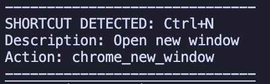

# ShortKey - The Ultimate Keyboard Shortcut Trainer, helping you learn shortcuts.

ShortKey is a simple Python application that intercepts keyboard input and allows you to learn shortcuts by having a glance at your terminal.
## Features

- Intercepts keyboard input while allowing you to normally use your keyboard
- Configurable keyboard shortcuts via JSON, allowing for customization and expansion
- Special browser control mode with Chrome/browser-specific shortcuts (Ctrl+Win+Alt Simultaneously)
- Real-time shortcut prediction and suggestions in terminal

## Next Steps

- Add a GUI
- Use Raspberry Pi to emulate a USB keyboard for Windows/MacOS
- Suggestion Ranking System

## Tested On

- Raspberry Pi (tested on Pi 5)
- Python 3.x
- Python packages:
  - evdev
  - logging
  - json

## Setup

### 1. Install dependencies:

```bash
pip install evdev
```

### 2. Make the script executable:

```bash
chmod +x ShortKey.py
```

### 3. Run the script:

```bash
./ShortKey.py
```

And you're done!

## Images




